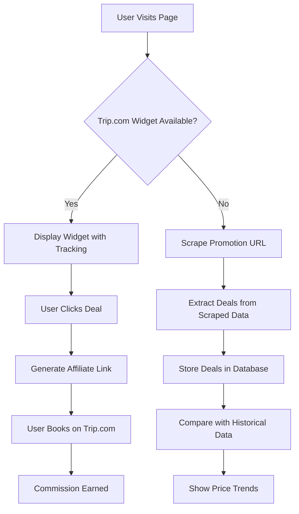

# Trip.com Data Collection & Comparison System

## Overview

This system enables scraping and collection of Trip.com promotional data for comparison and analysis. While affiliate tracking directs users to Trip.com, the scraping system allows you to **collect and compare deal data** programmatically.

---

## 🎯 Purpose

### Primary Goals
1. **Data Collection**: Extract promotional deals, prices, and metadata from Trip.com
2. **Comparison**: Enable price and deal comparison across different sources
3. **Analytics**: Track promotional trends and performance over time
4. **Future Features**: Build price alerts, deal aggregation, and smart recommendations

### Why Both Affiliate Links AND Scraping?

- **Affiliate Links**: Generate revenue through commissions when users book
- **Scraping**: Collect data for comparison, analytics, and intelligent features
- **Together**: Provide value to users (best deals) while monetizing through affiliates

---

## 🚀 Quick Start

### 1. Scrape Promotion Data

```typescript
import { useTripScraper } from '~/composables/useTripScraper'

const { loading, error, scrapePromotions } = useTripScraper()

// Scrape a promotion page
const result = await scrapePromotions(
  'https://sg.trip.com/sale/w/4747/flightrebate.html',
  'flight'
)

console.log('Deals found:', result?.deals.length)
console.log('First deal:', result?.deals[0])
```

### 2. Scrape Hotel Data

```typescript
const { scrapeHotels } = useTripScraper()

// Get hotel data for comparison
const result = await scrapeHotels({
  cityId: '33',  // Singapore
  checkinDate: '2025-03-01',
  checkoutDate: '2025-03-05',
  pageIndex: 1,
  pageSize: 20
})

console.log('Hotels fetched:', result)
```

### 3. Compare Multiple Sources

```typescript
const { scrapeMultiplePromotions } = useTripScraper()

const results = await scrapeMultiplePromotions([
  'https://www.trip.com/partners/ad/SB553583',
  'https://www.trip.com/partners/ad/DB552995'
], 'generic')

// Now compare the results!
results.forEach((result, index) => {
  console.log(`Source ${index + 1}:`, result.deals.length, 'deals')
})
```

---

## 📊 Data Structure

### Promotion Deal

```typescript
interface TripPromotionDeal {
  id?: string
  title: string
  description?: string
  originalPrice?: string
  discountedPrice?: string
  discount?: string
  currency?: string
  image?: string
  link?: string
  location?: string
  dates?: string
  category?: string
}
```

### Scrape Result

```typescript
interface TripScrapeResult {
  url: string                    // Scraped URL
  type: string                   // flight, hotel, activity, generic
  deals: TripPromotionDeal[]     // Array of deals found
  metadata?: {
    title?: string               // Page title
    description?: string         // Page description
    totalDeals?: number         // Total deals found
  }
}
```

---

## 🔧 Usage Examples

### Example 1: Basic Promotion Scraping

```vue
<template>
  <div>
    <button @click="fetchDeals" :disabled="loading">
      {{ loading ? 'Loading...' : 'Fetch Deals' }}
    </button>
    
    <div v-if="error" class="text-red-600">{{ error }}</div>
    
    <div v-if="deals">
      <div v-for="deal in deals" :key="deal.id">
        <h3>{{ deal.title }}</h3>
        <p>{{ deal.discountedPrice }}</p>
      </div>
    </div>
  </div>
</template>

<script setup lang="ts">
import { ref } from 'vue'
import { useTripScraper } from '~/composables/useTripScraper'

const { loading, error, scrapePromotions } = useTripScraper()
const deals = ref<any[]>([])

const fetchDeals = async () => {
  const result = await scrapePromotions(
    'https://sg.trip.com/sale/w/4747/flightrebate.html',
    'flight'
  )
  
  if (result) {
    deals.value = result.deals
  }
}
</script>
```

### Example 2: Price Comparison

```typescript
import { useTripScraper } from '~/composables/useTripScraper'

const { scrapeMultiplePromotions } = useTripScraper()

// Scrape from multiple Trip.com sources
const flightDeals = await scrapeMultiplePromotions([
  'https://www.trip.com/partners/ad/S553037',  // Desktop flight widget
  'https://sg.trip.com/sale/w/4747/flightrebate.html'
], 'flight')

// Compare prices
const comparePrices = () => {
  const allPrices = flightDeals.flatMap(result => 
    result.deals
      .map(deal => ({
        title: deal.title,
        price: parsePrice(deal.discountedPrice),
        source: result.url
      }))
      .filter(item => item.price)
  )
  
  // Sort by price
  allPrices.sort((a, b) => a.price - b.price)
  
  console.log('Best deals:', allPrices.slice(0, 10))
}

const parsePrice = (priceStr?: string): number => {
  if (!priceStr) return 0
  return parseFloat(priceStr.replace(/[^\d.]/g, ''))
}
```

### Example 3: Store Data for Comparison

```typescript
import { useTripScraper } from '~/composables/useTripScraper'

const { scrapePromotions } = useTripScraper()

// Scrape and store data
const collectPromotionalData = async () => {
  const sources = [
    { url: 'https://www.trip.com/partners/ad/SB553583', type: 'hotel' },
    { url: 'https://www.trip.com/partners/ad/DB552995', type: 'hotel' }
  ]
  
  const scrapedData = []
  
  for (const source of sources) {
    const result = await scrapePromotions(source.url, source.type)
    
    if (result && result.deals.length > 0) {
      scrapedData.push({
        source: source.url,
        scrapedAt: new Date().toISOString(),
        deals: result.deals,
        metadata: result.metadata
      })
    }
  }
  
  // Store in your database or send to backend
  // This enables historical comparison and trend analysis
  console.log('Collected data from', scrapedData.length, 'sources')
  
  return scrapedData
}
```

---

## 🌐 Demo Page

A demo page is available at `/trip-promotions-demo` to test the scraper:

### Features
- ✅ Input Trip.com URLs to scrape
- ✅ Select promotion type
- ✅ Display scraped deals with images and prices
- ✅ View page metadata
- ✅ Usage examples and code snippets

### Try It Out

1. Navigate to: `http://localhost:3000/trip-promotions-demo`
2. Enter a Trip.com promotion URL
3. Select the promotion type
4. Click "Scrape Data"
5. View the extracted deals

---

## 🎯 Integration Points

### Current Integration

The scraper integrates with:

1. **Trip.com Affiliate System**: Existing deep link generator (`useTripDeeplink`)
2. **Promotion Management**: Campaign configuration (`useTripPromotions`)
3. **Analytics**: Track scraping activity and results

### Future Integration Ideas

1. **Database Storage**: Store scraped data for historical analysis
2. **Price Alerts**: Notify users when prices drop
3. **Comparison Engine**: Auto-compare across multiple sources
4. **Trend Analysis**: Identify promotional patterns over time
5. **Smart Recommendations**: AI-powered deal suggestions

---

## ⚙️ API Reference

### `useTripScraper()`

Main composable for Trip.com scraping operations.

#### Methods

##### `scrapePromotions(url, type?, timeout?)`

Scrapes promotional deals from a Trip.com URL.

**Parameters:**
- `url: string` - Trip.com promotion/sale URL
- `type?: 'flight' | 'hotel' | 'activity' | 'generic'` - Promotion type (optional)
- `timeout?: number` - Request timeout in ms (default: 60000)

**Returns:** `Promise<TripScrapeResult | null>`

**Example:**
```typescript
const result = await scrapePromotions(
  'https://sg.trip.com/sale/w/4747/flightrebate.html',
  'flight'
)
```

##### `scrapeMultiplePromotions(urls, type?)`

Scrapes multiple promotion URLs simultaneously.

**Parameters:**
- `urls: string[]` - Array of Trip.com URLs
- `type?: 'flight' | 'hotel' | 'activity' | 'generic'` - Promotion type (optional)

**Returns:** `Promise<TripScrapeResult[]>`

**Example:**
```typescript
const results = await scrapeMultiplePromotions([
  'https://www.trip.com/partners/ad/SB553583',
  'https://www.trip.com/partners/ad/DB552995'
], 'hotel')
```

##### `scrapeHotels(params)`

Fetches hotel data using Trip.com's hotel API.

**Parameters:**
```typescript
{
  cityId: string
  checkinDate: string
  checkoutDate: string
  pageIndex?: number
  pageSize?: number
}
```

**Returns:** `Promise<any | null>`

**Example:**
```typescript
const hotels = await scrapeHotels({
  cityId: '33',
  checkinDate: '2025-03-01',
  checkoutDate: '2025-03-05',
  pageIndex: 1,
  pageSize: 20
})
```

#### Reactive Properties

##### `loading: Ref<boolean>`

Indicates if a scraping operation is in progress.

##### `error: Ref<string | null>`

Contains error message if scraping failed.

---

## 🔍 Supported URL Types

### 1. Promotion Sale Pages
```
https://sg.trip.com/sale/w/XXXX/XXXX.html
```

### 2. Widget Codes
```
https://www.trip.com/partners/ad/WIDGET_CODE
```

### 3. Deep Links
```
https://www.trip.com/flights/list?departure=XXX&arrival=YYY
```

---

## 🛡️ Error Handling

The scraper includes robust error handling:

### Common Errors

1. **Timeout**: Page took too long to load
   - Increase `timeout` parameter
   - Check network connection

2. **Invalid URL**: URL is not accessible
   - Verify URL is correct
   - Check if page requires authentication

3. **No Data Found**: Page structure changed
   - Update selectors in scraper
   - Contact support if persistent

### Example Error Handling

```typescript
const { error, scrapePromotions } = useTripScraper()

const fetchData = async () => {
  const result = await scrapePromotions(url)
  
  if (!result) {
    console.error('Scraping failed:', error.value)
    
    // Fallback to affiliate link if scraping fails
    window.open(url, '_blank')
    return
  }
  
  // Process data
  console.log('Success:', result.deals.length, 'deals found')
}
```

---

## 📈 Use Cases

### 1. Price Monitoring

```typescript
// Check price changes daily
const monitorPrices = async () => {
  const result = await scrapePromotions(url, 'hotel')
  
  if (result) {
    const todayPrices = result.deals.map(d => d.discountedPrice)
    
    // Compare with yesterday's prices
    const changed = compareWithPrevious(todayPrices)
    
    if (changed.length > 0) {
      notifyUsers(changed)
    }
  }
}
```

### 2. Deal Aggregation

```typescript
// Aggregate deals from multiple sources
const aggregateDeals = async () => {
  const sources = getTripPromotionUrls()
  const results = await scrapeMultiplePromotions(sources)
  
  // Combine and deduplicate
  const allDeals = deduplicate(
    results.flatMap(r => r.deals)
  )
  
  return sortByBestValue(allDeals)
}
```

### 3. Competitive Analysis

```typescript
// Compare Trip.com with other platforms
const comparePlatforms = async () => {
  const tripData = await scrapePromotions(tripUrl, 'flight')
  const agodaData = await scrapeAgoda(agodaUrl)
  const bookingData = await scrapeBooking(bookingUrl)
  
  // Create comparison report
  return generateComparisonReport([
    tripData,
    agodaData,
    bookingData
  ])
}
```

---

## 🔄 Workflow

### Typical Data Collection Flow



---

## ⚠️ Important Notes

### Rate Limiting

- Respect Trip.com's servers
- Don't scrape too frequently
- Consider implementing delays between requests
- Use caching for frequently accessed data

### Data Accuracy

- Scraped data may lag behind live prices
- Always include "Prices may vary" disclaimer
- Verify critical prices before showing to users
- Use affiliate links for actual bookings

### Legal Considerations

- Follow Trip.com's Terms of Service
- Check robots.txt before scraping
- Implement user-agent headers
- Respect copyright and content ownership

---

## 🚀 Future Enhancements

### Planned Features

1. **Real-time Price Monitoring**
   - Check prices every 5 minutes
   - Alert users of price drops
   - Track price history

2. **Smart Comparison**
   - Multi-platform comparison
   - Best value recommendations
   - Price prediction

3. **Data Export**
   - CSV export of deals
   - JSON API endpoints
   - Webhook notifications

4. **Advanced Analytics**
   - Deal performance metrics
   - User engagement tracking
   - Conversion optimization

---

## 📚 Resources

### Related Files

- `composables/useTripScraper.ts` - Main scraping composable
- `server/api/trip/scrape-promotions.ts` - Scraping API endpoint
- `server/api/trip/hotels.ts` - Hotel data API
- `composables/useTripPromotions.ts` - Campaign management
- `pages/trip-promotions-demo.vue` - Demo page

### Documentation

- `TRIP_PROMOTIONS_MANAGEMENT.md` - Promotion configuration
- `TRIP_DEEPLINK_STRATEGY.md` - Deep link strategy
- `README.md` - General documentation

---

## 🆘 Troubleshooting

### Issue: No deals found

**Possible Causes:**
- Page structure changed
- JavaScript-rendered content
- Anti-bot protection
- URL incorrect or expired

**Solutions:**
1. Check page manually in browser
2. Try different URL format
3. Increase wait timeout
4. Check for JavaScript errors

### Issue: Scraping timeout

**Possible Causes:**
- Slow network
- Large page content
- Complex JavaScript

**Solutions:**
1. Increase `timeout` parameter
2. Use `scrape-simple` API for static content
3. Implement retry logic
4. Check server performance

### Issue: Wrong data extracted

**Possible Causes:**
- Selectors outdated
- Multiple content structures
- Iframe content

**Solutions:**
1. Update scraper selectors
2. Add more fallback selectors
3. For iframes, scrape parent page directly
4. Contact Trip.com for widget API access

---

Made for GoTravelNha Data Collection & Comparison 🚀

